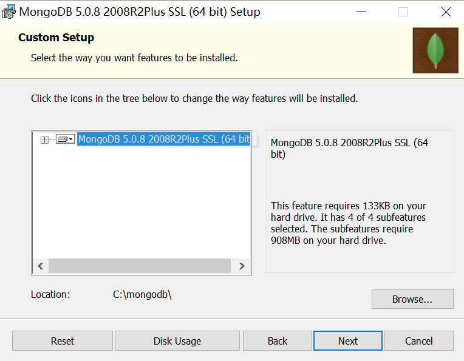
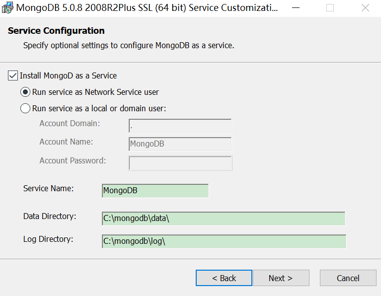
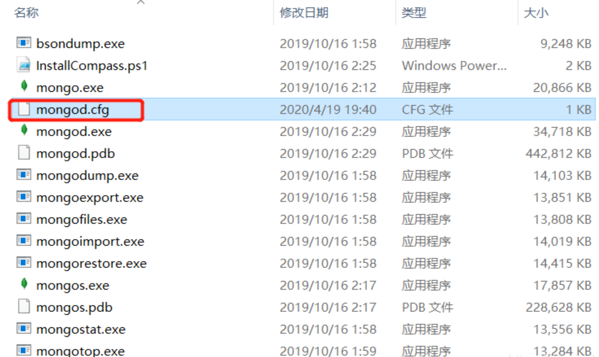
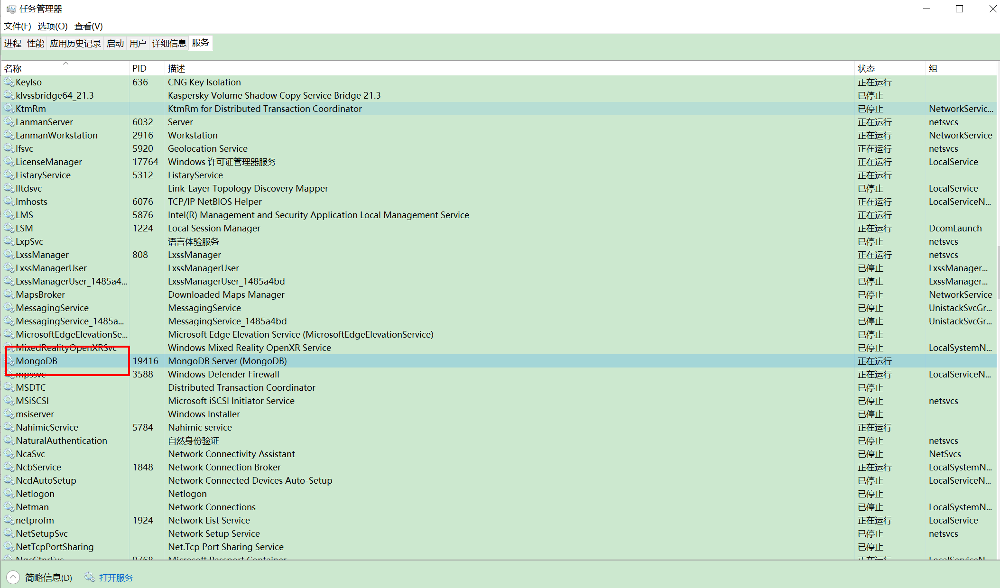

# Windows 平台安装与配置 MongoDB

## MongoDB 下载

MongoDB 提供了可用于 32 位和 64 位系统的预编译二进制包，你可以从MongoDB官网下载安装，MongoDB 预编译二进制包下载地址：https://www.mongodb.com/download-center/community

下载 .msi 文件，下载后双击该文件，按操作提示安装即可。

安装过程中，你可以通过点击 "Custom(自定义)" 按钮来设置你的安装目录。

修改路径为mongodb，目的是统一路径，方便修改

下一步安装 **"install mongoDB compass"** 不勾选（当然你也可以选择安装它，可能需要更久的安装时间），MongoDB Compass 是一个图形界面管理工具，我们可以在后面自己到官网下载安装，下载地址：https://www.mongodb.com/download-center/compass。

------

## 配置 MongoDB 服务器

**更改端口号**

找到MongoDB安装bin目录下的mongd.cfg文件，用文本编辑器打开。

注：这里的port 改为 9999，bindip改为0.0.0.0，默认127.0.0.1只能本地访问，改为0.0.0.0后可以远程访问。

改完后，可以通过任务管理器，重新启动MongoDB服务

