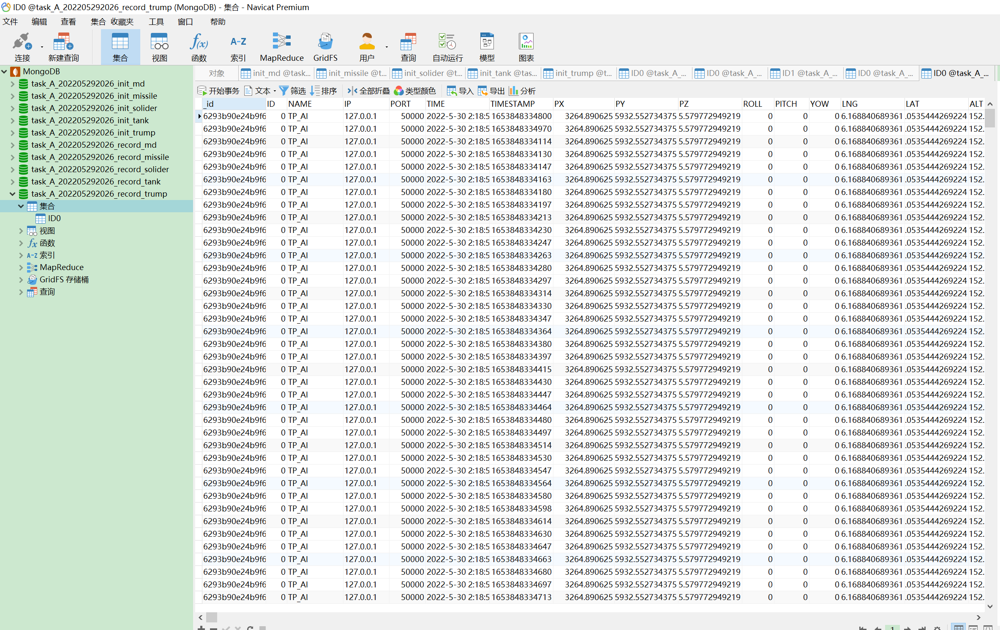

# RESTful API 与数据库中文文档


## 一、API 通用定义

> URL（POST）： http://`ip`:`port`/api/`interface`/`{key_value_pairs}`

 `ip`

> 接口服务所在主机的 IP 地址

 `port`

> 5000 (默认)

`interface`

> - `interface`: 目前支持十七个接口地址，分别是 start_service_tank，record_data_tank，control_tank，start_service_missile，record_data_missile，control_missile，start_service_solider，record_data_solider，control_solider，start_service_trump，record_data_trump，control_trump，start_service_md，record_data_md，control_md，start_service_camera，control_camera。
> - \*\_start_service：运动体初始化服务接口，需要在启动UE动画前进行通讯
> - \*\_record_data：运动体实时数据记录与信息通讯启动接口，需要在启动UE动画前进行通讯
> - \*\_control_tank：运动体控制接口，启动前两项通讯后，随时可以进行通讯控制

 `{key_value_pairs}`

> - JSON 字符串
> - Content-Type：application/json
> - `key_value_pairs` :  JSON 键值对
> - 前期以简化输入输出为原则，暂时没有输入数据类型判定，后期可以增加输入类型判定与UUID通讯信息等功能。

返回情况：

> - Serialized JSON 字符串
> - Content-Type：application/json
> - 注意“msg”中的中文返回，编码格式为Unicode，这个返回的目的仅是帮助通讯侧快速调试。
> - 后期可以考虑增加错误代码等功能。


## 二、API 接口说明


### 1. 坦克初始化服务接口

##### （1）接口名称

> start_service_tank

##### （2）接口地址

> http://`ip`:`port`/api/start_service_tank/`{key_value_pairs}`

##### （3）接口方式

POST
##### （4）接口功能

> 启动初始化服务，将 UE4 中各个坦克的编号、名称、通讯地址等数据记录在坦克信息初始化数据库中，并为后续储存进一步坦克数据信息或控制坦克提供通讯拓扑依据。

##### （5）请求内容

| 请求内容的键名 | 类型       | 是否必填或必填条件 | 说明 |
| -------------- | ---------- | ------------------ | ---- |
| data           | dictionary | True               |      |

| data 包含的子键名 | 类型   | 是否必填或必填条件 | 说明                                   |
| ----------------- | ------ | ------------------ | -------------------------------------- |
| host              | string | True               | 接口服务所在的 IP 地址                 |
| port              | int    | True               | 接口服务所在 IP 地址端口               |
| task              | string | True               | 坦克信息初始化数据库的对应的本次任务名 |

##### （6）请求示例

```json
{
    "data": {
        "host": "127.0.0.1",
        "port": 10001,
        "task":"task_A_202205292026"
    }
}
```


##### （7）返回结果

| 返回结果的键名 | 类型       | 说明                                 |
| -------------- | ---------- | ------------------------------------ |
| stat           | int        | 状态信息，`0` 表示成功，`1` 表示错误 |
| msg            | string     | 成功信息或错误信息                   |
| data           | dictionary |                                      |

| data 包含的子键名 | 类型       | 说明                                                         |
| ----------------- | ---------- | ------------------------------------------------------------ |
| origin_coordinate | list       | 值对应动态坐标系的原点坐标在 UE4 中的静态坐标位置，接收后可用于坐标系数据转换 |
| info_dict         | dictionary | 记录了各个坦克名称对应的 id号、IP地址、端口号                |

| origin_coordinate 包含的子元素 | 类型  | 说明                                            |
| ------------------------------ | ----- | ----------------------------------------------- |
| `ox`                           | float | UE动态坐标系的原点在UE静态坐标系中坐标的 x 分量 |
| `oy`                           | float | UE动态坐标系的原点在UE静态坐标系中坐标的 y 分量 |
| `oz`                           | float | UE动态坐标系的原点在UE静态坐标系中坐标的 z 分量 |

| info_dict 包含的子键名 | 类型 | 说明                                                         |
| ---------------------- | ---- | ------------------------------------------------------------ |
| `tank_name`            | list | 键名是各个坦克名称，对应的 list 子元素包括坦克的编号、名称、通讯地址等数据 |

| `tank_name` list 包含的子元素 | 类型   | 说明                     |
| ----------------------------- | ------ | ------------------------ |
| `id`                          | int    | 坦克 id 编号             |
| `ip`                          | string | 坦克所在服务器的 IP 地址 |
| `port`                        | int    | 该坦克对应的端口         |

##### （8）返回结果示例

```json
{
    "stat": 0,
    "msg": "Success!",
    "data": {
        "origin_coordinate": [
            6000.0,
            6000.0,
            120.0
        ],
        "info_dict": {
            "TK_AI": [
                0,
                "127.0.0.1",
                20000
            ],
            "TK_AI2": [
                1,
                "127.0.0.1",
                20001
            ],
            "TK_AI3": [
                2,
                "127.0.0.1",
                20002
            ]
        }
    }
}
```


### 2. 坦克数据记录与信息通讯启动接口

##### （1）接口名称

> record_data_tank

##### （2）接口地址

> http://`ip`:`port`/api/record_data_tank/`{key_value_pairs}`

##### （3）接口方式

POST

##### （4）接口功能

> 启动各个坦克的实时数据记录功能，记录频率为 60 Hz，并为各个坦克生成通讯体，方便后续对各个坦克的动作控制进行通讯。

##### （5）请求内容

| 请求内容的键名 | 类型       | 是否必填或必填条件 | 说明 |
| -------------- | ---------- | ------------------ | ---- |
| data           | dictionary | True               |      |

| data 包含的子键名 | 类型   | 是否必填或必填条件 | 说明                                                         |
| ----------------- | ------ | ------------------ | ------------------------------------------------------------ |
| task              | string | True               | 本次任务名称，记录坦克实时数据的数据库名称的前缀，每个坦克都有一个表来单独记录各自数据，表的名称就是坦克 id 编号。 |
| record_all        | int    | True               | `1` 对应记录所有坦克的实时数据信息，当前只允许输入值`1`，未来支持部分坦克不记录实时数据，到时候可输入 `0` 与需要记录实时数据的坦克名称或编号 list，当前先保留此键值。 |

##### （6）请求示例

```json
{
    "data": {
        "task":"task_A_202205292026",
        "record_all": 1
    }
}
```


##### （7）返回结果

| 返回结果的键名 | 类型   | 说明                                 |
| -------------- | ------ | ------------------------------------ |
| stat           | int    | 状态信息，`0` 表示成功，`1` 表示错误 |
| msg            | string | 成功信息或错误信息                   |

##### （8）返回结果示例

```json
{
    "stat": 0,
    "msg": "Success!"
}
```


### 3. 坦克控制接口

##### （1）接口名称

> control_tank

##### （2）接口地址

>  http://`ip`:`port`/api/control_tank/`{key_value_pairs}`

##### （3）接口方式

> POST

##### （4）接口功能

> 对各个坦克进行控制，支持两种可选的控制方式：1. 给目的地坐标，自主移动；2. 通过油门和转向控制坦克移动。

##### （5）请求内容

| 请求内容的键名 | 类型       | 是否必填或必填条件 | 说明 |
| -------------- | ---------- | ------------------ | ---- |
| data           | dictionary | True               |      |

| data 包含的子键名 | 类型       | 是否必填或必填条件 | 说明                                     |
| ----------------- | ---------- | ------------------ | ---------------------------------------- |
| `tank_name`       | dictionary | True               | 此键名为坦克名称，对应的值是坦克控制数据 |

| `tank_name`包含的子键名 | 类型       | 是否必填或必填条件 | 说明         |
| ----------------------- | ---------- | ------------------ | ------------ |
| data                    | dictionary | True               | 坦克控制数据 |

| `tank_name`的子键 data 包含的子健名 | 类型       | 是否必填或必填条件 | 说明                                                         |
| ----------------------------------- | ---------- | ------------------ | ------------------------------------------------------------ |
| option                              | int        | True               | 坦克控制方式，为 `0` 时，选择目的地坐标到达模式，为 `1` 时，选择油门与转向控制模式 |
| destination                         | dictionary | option值为 `0`     | 目的地坐标到达模式                                           |
| control                             | dictionary | option值为 `1`     | 油门与转向控制模式                                           |

| destination 包含的子健名 | 类型  | 是否必填或必填条件 | 说明                          |
| ------------------------ | ----- | ------------------ | ----------------------------- |
| lng                      | float | True               | 目的地在WGS84坐标系中的经度值 |
| lat                      | float | True               | 目的地在WGS84坐标系中的纬度值 |
| alt                      | float | True               | 目的地在WGS84坐标系中的高程值 |

| control 包含的子健名 | 类型  | 是否必填或必填条件 | 说明                                   |
| -------------------- | ----- | ------------------ | -------------------------------------- |
| steering             | float | True               | 转向，范围是 [-1.0,1.0]                |
| throttle             | float | True               | 油门，范围是 [-1.0,1.0]                |
| handbrake            | bool  | True               | 刹车，`true`为刹车，`false` 为解除刹车 |

##### （6）请求示例

```json
{
    "data": {
        "TK_AI2": {
            "data": {
                "option": 1,
                "control": {
                    "steering": 0.0,
                    "throttle": 1.0,
                    "handbrake": false
                }
            }
        },
        "TK_AI": {
            "data": {
                "option": 0,
                "destination": {
                    "lng": 116.174893,
                    "lat": 40.055154,
                    "alt": 150.0
                }
            }
        }
    }
}
```


##### （7）返回结果

| 返回结果的键名 | 类型   | 说明                                 |
| -------------- | ------ | ------------------------------------ |
| stat           | int    | 状态信息，`0` 表示成功，`1` 表示错误 |
| msg            | string | 成功信息或错误信息                   |

##### （8）返回结果示例

```json
{
    "stat": 0,
    "msg": "Success!"
}
```


### 4. 导弹初始化服务接口

##### （1）接口名称

> start_service_missile

##### （2）接口地址

> http://`ip`:`port`/api/start_service_missile/`{key_value_pairs}`

##### （3）接口方式

POST

##### （4）接口功能

> 启动初始化服务，将 UE4 中各个导弹的编号、名称、通讯地址等数据记录在导弹信息初始化数据库中，并为后续储存进一步导弹数据信息或控制导弹提供通讯拓扑依据。

##### （5）请求内容

| 请求内容的键名 | 类型       | 是否必填或必填条件 | 说明 |
| -------------- | ---------- | ------------------ | ---- |
| data           | dictionary | True               |      |

| data 包含的子键名 | 类型   | 是否必填或必填条件 | 说明                                   |
| ----------------- | ------ | ------------------ | -------------------------------------- |
| host              | string | True               | 接口服务所在的 IP 地址                 |
| port              | int    | True               | 接口服务所在 IP 地址端口               |
| task              | string | True               | 导弹信息初始化数据库的对应的本次任务名 |

##### （6）请求示例

```json
{
    "data": {
        "host": "127.0.0.1",
        "port": 10002,
        "task":"task_A_202205292026"
    }
}
```


##### （7）返回结果

| 返回结果的键名 | 类型       | 说明                                 |
| -------------- | ---------- | ------------------------------------ |
| stat           | int        | 状态信息，`0` 表示成功，`1` 表示错误 |
| msg            | string     | 成功信息或错误信息                   |
| data           | dictionary |                                      |

| data 包含的子键名 | 类型       | 说明                                                         |
| ----------------- | ---------- | ------------------------------------------------------------ |
| origin_coordinate | list       | 值对应动态坐标系的原点坐标在 UE4 中的静态坐标位置，接收后可用于坐标系数据转换 |
| info_dict         | dictionary | 记录了各个导弹名称对应的 id号、IP地址、端口号                |

| origin_coordinate 包含的子元素 | 类型  | 说明                                            |
| ------------------------------ | ----- | ----------------------------------------------- |
| `ox`                           | float | UE动态坐标系的原点在UE静态坐标系中坐标的 x 分量 |
| `oy`                           | float | UE动态坐标系的原点在UE静态坐标系中坐标的 y 分量 |
| `oz`                           | float | UE动态坐标系的原点在UE静态坐标系中坐标的 z 分量 |

| info_dict 包含的子键名 | 类型 | 说明                                                         |
| ---------------------- | ---- | ------------------------------------------------------------ |
| `missile_name`         | list | 键名是各个导弹名称，对应的 list 子元素包括导弹的编号、名称、通讯地址等数据 |

| `tank_name` list 包含的子元素 | 类型   | 说明                     |
| ----------------------------- | ------ | ------------------------ |
| `id`                          | int    | 导弹 id 编号             |
| `ip`                          | string | 导弹所在服务器的 IP 地址 |
| `port`                        | int    | 该导弹对应的端口         |

##### （8）返回结果示例

```json
{
    "stat": 0,
    "msg": "Success!",
    "data": {
        "origin_coordinate": [
            6000.0,
            6000.0,
            120.0
        ],
        "info_dict": {
            "MIS_AI": [
                0,
                "127.0.0.1",
                30000
            ],
            "MIS_AI2": [
                1,
                "127.0.0.1",
                30001
            ],
            "MIS_AI3": [
                2,
                "127.0.0.1",
                30002
            ]
        }
    }
}
```


### 5. 导弹数据记录与信息通讯启动接口

##### （1）接口名称

> record_data_missile

##### （2）接口地址

> http://`ip`:`port`/api/record_data_missile/`{key_value_pairs}`

##### （3）接口方式

POST

##### （4）接口功能

> 启动各个导弹的实时数据记录功能，记录频率为 60 Hz，并为各个导弹生成通讯体，方便后续对各个导弹的动作控制进行通讯。

##### （5）请求内容

| 请求内容的键名 | 类型       | 是否必填或必填条件 | 说明 |
| -------------- | ---------- | ------------------ | ---- |
| data           | dictionary | True               |      |

| data 包含的子键名 | 类型   | 是否必填或必填条件 | 说明                                                         |
| ----------------- | ------ | ------------------ | ------------------------------------------------------------ |
| task              | string | True               | 本次任务名称，记录导弹实时数据的数据库名称的前缀，每个导弹都有一个表来单独记录各自数据，表的名称就是导弹 id 编号。 |
| record_all        | int    | True               | `1` 对应记录所有导弹的实时数据信息，当前只允许输入值`1`，未来支持部分导弹不记录实时数据，到时候可输入 `0` 与需要记录实时数据的导弹名称或编号 list，当前先保留此键值。 |

##### （6）请求示例

```json
{
    "data": {
        "task":"task_A_202205292026",
        "record_all": 1
    }
}
```


##### （7）返回结果

| 返回结果的键名 | 类型   | 说明                                 |
| -------------- | ------ | ------------------------------------ |
| stat           | int    | 状态信息，`0` 表示成功，`1` 表示错误 |
| msg            | string | 成功信息或错误信息                   |

##### （8）返回结果示例

```json
{
    "stat": 0,
    "msg": "Success!"
}
```


### 6. 导弹控制接口

##### （1）接口名称

> control_missile

##### （2）接口地址

>  http://`ip`:`port`/api/control_missile/`{key_value_pairs}`

##### （3）接口方式

> POST

##### （4）接口功能

> 对各个导弹进行控制，有两种相配合的控制方式：1. 目标瞄准：锁定目标的GPS坐标，对目标进行不断瞄准，发射前后均可瞄准；2. 导弹发射：发射导弹。

##### （5）请求内容

| 请求内容的键名 | 类型       | 是否必填或必填条件 | 说明 |
| -------------- | ---------- | ------------------ | ---- |
| data           | dictionary | True               |      |

| data 包含的子键名 | 类型       | 是否必填或必填条件 | 说明                                     |
| ----------------- | ---------- | ------------------ | ---------------------------------------- |
| `missile_name`    | dictionary | True               | 此键名为导弹名称，对应的值是导弹控制数据 |

| `missile_name`包含的子键名 | 类型       | 是否必填或必填条件 | 说明         |
| -------------------------- | ---------- | ------------------ | ------------ |
| data                       | dictionary | True               | 导弹控制数据 |

| `missile_name`的子键 data 包含的子健名 | 类型       | 是否必填或必填条件 | 说明                                                         |
| -------------------------------------- | ---------- | ------------------ | ------------------------------------------------------------ |
| option                                 | int        | True               | 导弹控制方式，为 `0` 时，告诉导弹目标的GPS坐标位置，为 `1` 时，则发射导弹，导弹发射前后，都可以通信目标位置 |
| destination                            | dictionary | option值为 `0`     | 目标的 GPS 坐标位置                                          |

| destination 包含的子健名 | 类型  | 是否必填或必填条件 | 说明                        |
| ------------------------ | ----- | ------------------ | --------------------------- |
| lng                      | float | True               | 目标在WGS84坐标系中的经度值 |
| lat                      | float | True               | 目标在WGS84坐标系中的纬度值 |
| alt                      | float | True               | 目标在WGS84坐标系中的高程值 |

##### （6）请求示例

```json
{
    "data": {
        "MIS_AI2": {
            "data": {
                "option": 1,
            }
        },
        "MIS_AI": {
            "data": {
                "option": 0,
                "destination": {
                    "lng": 116.174893,
                    "lat": 40.055154,
                    "alt": 150.0
                }
            }
        }
    }
}
```


##### （7）返回结果

| 返回结果的键名 | 类型   | 说明                                 |
| -------------- | ------ | ------------------------------------ |
| stat           | int    | 状态信息，`0` 表示成功，`1` 表示错误 |
| msg            | string | 成功信息或错误信息                   |

##### （8）返回结果示例

```json
{
    "stat": 0,
    "msg": "Success!"
}
```


### 7. 士兵初始化服务接口

##### （1）接口名称

> start_service_solider

##### （2）接口地址

> http://`ip`:`port`/api/start_service_solider/`{key_value_pairs}`

##### （3）接口方式

POST

##### （4）接口功能

> 启动初始化服务，将 UE4 中各个士兵的编号、名称、通讯地址等数据记录在士兵信息初始化数据库中，并为后续储存进一步士兵数据信息或控制士兵提供通讯拓扑依据。

##### （5）请求内容

| 请求内容的键名 | 类型       | 是否必填或必填条件 | 说明 |
| -------------- | ---------- | ------------------ | ---- |
| data           | dictionary | True               |      |

| data 包含的子键名 | 类型   | 是否必填或必填条件 | 说明                                   |
| ----------------- | ------ | ------------------ | -------------------------------------- |
| host              | string | True               | 接口服务所在的 IP 地址                 |
| port              | int    | True               | 接口服务所在 IP 地址端口               |
| task              | string | True               | 士兵信息初始化数据库的对应的本次任务名 |

##### （6）请求示例

```json
{
    "data": {
        "host": "127.0.0.1",
        "port": 10003,
        "task":"task_A_202205292026"
    }
}
```


##### （7）返回结果

| 返回结果的键名 | 类型       | 说明                                 |
| -------------- | ---------- | ------------------------------------ |
| stat           | int        | 状态信息，`0` 表示成功，`1` 表示错误 |
| msg            | string     | 成功信息或错误信息                   |
| data           | dictionary |                                      |

| data 包含的子键名 | 类型       | 说明                                                         |
| ----------------- | ---------- | ------------------------------------------------------------ |
| origin_coordinate | list       | 值对应动态坐标系的原点坐标在 UE4 中的静态坐标位置，接收后可用于坐标系数据转换 |
| info_dict         | dictionary | 记录了各个士兵名称对应的 id号、IP地址、端口号                |

| origin_coordinate 包含的子元素 | 类型  | 说明                                            |
| ------------------------------ | ----- | ----------------------------------------------- |
| `ox`                           | float | UE动态坐标系的原点在UE静态坐标系中坐标的 x 分量 |
| `oy`                           | float | UE动态坐标系的原点在UE静态坐标系中坐标的 y 分量 |
| `oz`                           | float | UE动态坐标系的原点在UE静态坐标系中坐标的 z 分量 |

| info_dict 包含的子键名 | 类型 | 说明                                                         |
| ---------------------- | ---- | ------------------------------------------------------------ |
| `solider_name`         | list | 键名是各个士兵名称，对应的 list 子元素包括士兵的编号、名称、通讯地址等数据 |

| `solider_name` list 包含的子元素 | 类型   | 说明                     |
| -------------------------------- | ------ | ------------------------ |
| `id`                             | int    | 士兵 id 编号             |
| `ip`                             | string | 士兵所在服务器的 IP 地址 |
| `port`                           | int    | 该士兵对应的端口         |

##### （8）返回结果示例

```json
{
    "stat": 0,
    "msg": "Success!",
    "data": {
        "origin_coordinate": [
            6000.0,
            6000.0,
            120.0
        ],
        "info_dict": {
            "SOL_AI": [
                0,
                "127.0.0.1",
                40000
            ],
            "SOL_AI2": [
                1,
                "127.0.0.1",
                40001
            ],
            "SOL_AI3": [
                2,
                "127.0.0.1",
                40002
            ]
        }
    }
}
```


### 8. 士兵数据记录与信息通讯启动接口

##### （1）接口名称

> record_data_solider

##### （2）接口地址

> http://`ip`:`port`/api/record_data_solider/`{key_value_pairs}`

##### （3）接口方式

POST

##### （4）接口功能

> 启动各个士兵的实时数据记录功能，记录频率为 60 Hz，并为各个士兵生成通讯体，方便后续对各个士兵的动作控制进行通讯。

##### （5）请求内容

| 请求内容的键名 | 类型       | 是否必填或必填条件 | 说明 |
| -------------- | ---------- | ------------------ | ---- |
| data           | dictionary | True               |      |

| data 包含的子键名 | 类型   | 是否必填或必填条件 | 说明                                                         |
| ----------------- | ------ | ------------------ | ------------------------------------------------------------ |
| task              | string | True               | 本次任务名称，记录士兵实时数据的数据库名称的前缀，每个士兵都有一个表来单独记录各自数据，表的名称就是士兵 id 编号。 |
| record_all        | int    | True               | `1` 对应记录所有士兵的实时数据信息，当前只允许输入值`1`，未来支持部分士兵不记录实时数据，到时候可输入 `0` 与需要记录实时数据的士兵名称或编号 list，当前先保留此键值。 |

##### （6）请求示例

```json
{
    "data": {
        "task":"task_A_202205292026",
        "record_all": 1
    }
}
```


##### （7）返回结果

| 返回结果的键名 | 类型   | 说明                                 |
| -------------- | ------ | ------------------------------------ |
| stat           | int    | 状态信息，`0` 表示成功，`1` 表示错误 |
| msg            | string | 成功信息或错误信息                   |

##### （8）返回结果示例

```json
{
    "stat": 0,
    "msg": "Success!"
}
```


### 9. 士兵控制接口

##### （1）接口名称

> control_solider

##### （2）接口地址

>  http://`ip`:`port`/api/control_solider/`{key_value_pairs}`

##### （3）接口方式

> POST

##### （4）接口功能

> 对各个士兵进行控制，支持两种可选的控制方式：1. 给目的地坐标，自主移动；2. 通过向前（向北）和向右（向东）控制士兵移动。

##### （5）请求内容

| 请求内容的键名 | 类型       | 是否必填或必填条件 | 说明 |
| -------------- | ---------- | ------------------ | ---- |
| data           | dictionary | True               |      |

| data 包含的子键名 | 类型       | 是否必填或必填条件 | 说明                                     |
| ----------------- | ---------- | ------------------ | ---------------------------------------- |
| `solider_name`    | dictionary | True               | 此键名为士兵名称，对应的值是士兵控制数据 |

| `solider_name`包含的子键名 | 类型       | 是否必填或必填条件 | 说明         |
| -------------------------- | ---------- | ------------------ | ------------ |
| data                       | dictionary | True               | 士兵控制数据 |

| `solider_name`的子键 data 包含的子健名 | 类型       | 是否必填或必填条件 | 说明                                                         |
| -------------------------------------- | ---------- | ------------------ | ------------------------------------------------------------ |
| option                                 | int        | True               | 士兵控制方式，为 `0` 时，选择目的地坐标到达模式，为 `1` 时，选择向前与向右控制模式，为 `2` 时，士兵如果在椅子旁边，就会坐下，为 `3` 时，士兵做出死亡动作并消失。 |
| destination                            | dictionary | option值为 `0`     | 目的地坐标到达模式                                           |
| control                                | dictionary | option值为 `1`     | 向前（向北）与向右（向东）控制模式                           |

| destination 包含的子健名 | 类型  | 是否必填或必填条件 | 说明                          |
| ------------------------ | ----- | ------------------ | ----------------------------- |
| lng                      | float | True               | 目的地在WGS84坐标系中的经度值 |
| lat                      | float | True               | 目的地在WGS84坐标系中的纬度值 |
| alt                      | float | True               | 目的地在WGS84坐标系中的高程值 |

| control 包含的子健名 | 类型  | 是否必填或必填条件 | 说明                            |
| -------------------- | ----- | ------------------ | ------------------------------- |
| forward              | float | True               | 向前（向北），范围是 [-1.0,1.0] |
| right                | float | True               | 向右（向东），范围是 [-1.0,1.0] |

##### （6）请求示例

```json
{
    "data": {
        "SOL_AI2": {
            "data": {
                "option": 1,
                "control": {
                    "forward": 0.2,
                    "right": 0.0
                }
            }
        },
        "SOL_AI3": {
            "data": {
                "option": 2
            }
        },
        "SOL_AI4": {
            "data": {
                "option": 3
            }
        },
        "SOL_AI": {
            "data": {
                "option": 0,
                "destination": {
                    "lng": 116.174893,
                    "lat": 40.055154,
                    "alt": 150.0
                }
            }
        }
    }
}
```


##### （7）返回结果

| 返回结果的键名 | 类型   | 说明                                 |
| -------------- | ------ | ------------------------------------ |
| stat           | int    | 状态信息，`0` 表示成功，`1` 表示错误 |
| msg            | string | 成功信息或错误信息                   |

##### （8）返回结果示例

```json
{
    "stat": 0,
    "msg": "Success!"
}
```


### 10. 特朗普初始化服务接口

##### （1）接口名称

> start_service_trump

##### （2）接口地址

> http://`ip`:`port`/api/start_service_trump/`{key_value_pairs}`

##### （3）接口方式

POST

##### （4）接口功能

> 启动初始化服务，将 UE4 中各个特朗普的编号、名称、通讯地址等数据记录在特朗普信息初始化数据库中，并为后续储存进一步特朗普数据信息或控制特朗普提供通讯拓扑依据。

##### （5）请求内容

| 请求内容的键名 | 类型       | 是否必填或必填条件 | 说明 |
| -------------- | ---------- | ------------------ | ---- |
| data           | dictionary | True               |      |

| data 包含的子键名 | 类型   | 是否必填或必填条件 | 说明                                     |
| ----------------- | ------ | ------------------ | ---------------------------------------- |
| host              | string | True               | 接口服务所在的 IP 地址                   |
| port              | int    | True               | 接口服务所在 IP 地址端口                 |
| task              | string | True               | 特朗普信息初始化数据库的对应的本次任务名 |

##### （6）请求示例

```json
{
    "data": {
        "host": "127.0.0.1",
        "port": 10004,
        "task":"task_A_202205292026"
    }
}
```


##### （7）返回结果

| 返回结果的键名 | 类型       | 说明                                 |
| -------------- | ---------- | ------------------------------------ |
| stat           | int        | 状态信息，`0` 表示成功，`1` 表示错误 |
| msg            | string     | 成功信息或错误信息                   |
| data           | dictionary |                                      |

| data 包含的子键名 | 类型       | 说明                                                         |
| ----------------- | ---------- | ------------------------------------------------------------ |
| origin_coordinate | list       | 值对应动态坐标系的原点坐标在 UE4 中的静态坐标位置，接收后可用于坐标系数据转换 |
| info_dict         | dictionary | 记录了各个特朗普名称对应的 id号、IP地址、端口号              |

| origin_coordinate 包含的子元素 | 类型  | 说明                                            |
| ------------------------------ | ----- | ----------------------------------------------- |
| `ox`                           | float | UE动态坐标系的原点在UE静态坐标系中坐标的 x 分量 |
| `oy`                           | float | UE动态坐标系的原点在UE静态坐标系中坐标的 y 分量 |
| `oz`                           | float | UE动态坐标系的原点在UE静态坐标系中坐标的 z 分量 |

| info_dict 包含的子键名 | 类型 | 说明                                                         |
| ---------------------- | ---- | ------------------------------------------------------------ |
| `trump_name`           | list | 键名是各个特朗普名称，对应的 list 子元素包括特朗普的编号、名称、通讯地址等数据 |

| `solider_name` list 包含的子元素 | 类型   | 说明                             |
| -------------------------------- | ------ | -------------------------------- |
| `id`                             | int    | 特朗普 id 编号，允许有多个特朗普 |
| `ip`                             | string | 特朗普所在服务器的 IP 地址       |
| `port`                           | int    | 该特朗普对应的端口               |

##### （8）返回结果示例

```json
{
    "stat": 0,
    "msg": "Success!",
    "data": {
        "origin_coordinate": [
            6000.0,
            6000.0,
            120.0
        ],
        "info_dict": {
            "TP_AI": [
                0,
                "127.0.0.1",
                50000
            ],
            "TP_AI2": [
                1,
                "127.0.0.1",
                50001
            ],
            "TP_AI3": [
                2,
                "127.0.0.1",
                50002
            ]
        }
    }
}
```


### 11. 特朗普数据记录与信息通讯启动接口

##### （1）接口名称

> record_data_trump

##### （2）接口地址

> http://`ip`:`port`/api/record_data_trump/`{key_value_pairs}`

##### （3）接口方式

POST

##### （4）接口功能

> 启动各个特朗普的实时数据记录功能，记录频率为 60 Hz，并为各个特朗普生成通讯体，方便后续对各个特朗普的动作控制进行通讯。

##### （5）请求内容

| 请求内容的键名 | 类型       | 是否必填或必填条件 | 说明 |
| -------------- | ---------- | ------------------ | ---- |
| data           | dictionary | True               |      |

| data 包含的子键名 | 类型   | 是否必填或必填条件 | 说明                                                         |
| ----------------- | ------ | ------------------ | ------------------------------------------------------------ |
| task              | string | True               | 本次任务名称，记录特朗普实时数据的数据库名称的前缀，每个特朗普都有一个表来单独记录各自数据，表的名称就是特朗普 id 编号。 |
| record_all        | int    | True               | `1` 对应记录所有特朗普的实时数据信息，当前只允许输入值`1`，未来支持部分特朗普不记录实时数据，到时候可输入 `0` 与需要记录实时数据的特朗普名称或编号 list，当前先保留此键值。 |

##### （6）请求示例

```json
{
    "data": {
        "task":"task_A_202205292026",
        "record_all": 1
    }
}
```


##### （7）返回结果

| 返回结果的键名 | 类型   | 说明                                 |
| -------------- | ------ | ------------------------------------ |
| stat           | int    | 状态信息，`0` 表示成功，`1` 表示错误 |
| msg            | string | 成功信息或错误信息                   |

##### （8）返回结果示例

```json
{
    "stat": 0,
    "msg": "Success!"
}
```


### 12. 特朗普控制接口

##### （1）接口名称

> control_trump

##### （2）接口地址

>  http://`ip`:`port`/api/control_trump/`{key_value_pairs}`

##### （3）接口方式

> POST

##### （4）接口功能

> 对各个特朗普进行控制，支持两种可选的控制方式：1. 给目的地坐标，自主移动；2. 通过向前（向北）和向右（向东）控制特朗普移动。

##### （5）请求内容

| 请求内容的键名 | 类型       | 是否必填或必填条件 | 说明 |
| -------------- | ---------- | ------------------ | ---- |
| data           | dictionary | True               |      |

| data 包含的子键名 | 类型       | 是否必填或必填条件 | 说明                                         |
| ----------------- | ---------- | ------------------ | -------------------------------------------- |
| `trump_name`      | dictionary | True               | 此键名为特朗普名称，对应的值是特朗普控制数据 |

| `trump_name`包含的子键名 | 类型       | 是否必填或必填条件 | 说明           |
| ------------------------ | ---------- | ------------------ | -------------- |
| data                     | dictionary | True               | 特朗普控制数据 |

| `trump_name`的子键 data 包含的子健名 | 类型       | 是否必填或必填条件 | 说明                                                         |
| ------------------------------------ | ---------- | ------------------ | ------------------------------------------------------------ |
| option                               | int        | True               | 特朗普控制方式，为 `0` 时，选择目的地坐标到达模式，为 `1` 时，选择向前与向右控制模式，为 `2` 时，特朗普如果在椅子旁边，就会坐下，为 `3` 时，特朗普做出死亡动作并消失。 |
| destination                          | dictionary | option值为 `0`     | 目的地坐标到达模式                                           |
| control                              | dictionary | option值为 `1`     | 向前（向北）与向右（向东）控制模式                           |

| destination 包含的子健名 | 类型  | 是否必填或必填条件 | 说明                          |
| ------------------------ | ----- | ------------------ | ----------------------------- |
| lng                      | float | True               | 目的地在WGS84坐标系中的经度值 |
| lat                      | float | True               | 目的地在WGS84坐标系中的纬度值 |
| alt                      | float | True               | 目的地在WGS84坐标系中的高程值 |

| control 包含的子健名 | 类型  | 是否必填或必填条件 | 说明                            |
| -------------------- | ----- | ------------------ | ------------------------------- |
| forward              | float | True               | 向前（向北），范围是 [-1.0,1.0] |
| right                | float | True               | 向右（向东），范围是 [-1.0,1.0] |

##### （6）请求示例

```json
{
    "data": {
        "TP_AI2": {
            "data": {
                "option": 1,
                "control": {
                    "forward": 0.2,
                    "right": 0.0
                }
            }
        },
        "TP_AI3": {
            "data": {
                "option": 2
            }
        },
        "TP_AI4": {
            "data": {
                "option": 3
            }
        },
        "TP_AI": {
            "data": {
                "option": 0,
                "destination": {
                    "lng": 116.174893,
                    "lat": 40.055154,
                    "alt": 150.0
                }
            }
        }
    }
}
```


##### （7）返回结果

| 返回结果的键名 | 类型   | 说明                                 |
| -------------- | ------ | ------------------------------------ |
| stat           | int    | 状态信息，`0` 表示成功，`1` 表示错误 |
| msg            | string | 成功信息或错误信息                   |

##### （8）返回结果示例

```json
{
    "stat": 0,
    "msg": "Success!"
}
```


### 13. 拦截弹初始化服务接口

##### （1）接口名称

> start_service_md

##### （2）接口地址

> http://`ip`:`port`/api/start_service_md/`{key_value_pairs}`

##### （3）接口方式

POST

##### （4）接口功能

> 启动初始化服务，将 UE4 中各个拦截弹的编号、名称、通讯地址等数据记录在导弹信息初始化数据库中，并为后续储存进一步拦截弹数据信息或控制拦截弹提供通讯拓扑依据。

##### （5）请求内容

| 请求内容的键名 | 类型       | 是否必填或必填条件 | 说明 |
| -------------- | ---------- | ------------------ | ---- |
| data           | dictionary | True               |      |

| data 包含的子键名 | 类型   | 是否必填或必填条件 | 说明                                     |
| ----------------- | ------ | ------------------ | ---------------------------------------- |
| host              | string | True               | 接口服务所在的 IP 地址                   |
| port              | int    | True               | 接口服务所在 IP 地址端口                 |
| task              | string | True               | 拦截弹信息初始化数据库的对应的本次任务名 |

##### （6）请求示例

```json
{
    "data": {
        "host": "127.0.0.1",
        "port": 10005,
        "task":"task_A_202205292026"
    }
}
```


##### （7）返回结果

| 返回结果的键名 | 类型       | 说明                                 |
| -------------- | ---------- | ------------------------------------ |
| stat           | int        | 状态信息，`0` 表示成功，`1` 表示错误 |
| msg            | string     | 成功信息或错误信息                   |
| data           | dictionary |                                      |

| data 包含的子键名 | 类型       | 说明                                                         |
| ----------------- | ---------- | ------------------------------------------------------------ |
| origin_coordinate | list       | 值对应动态坐标系的原点坐标在 UE4 中的静态坐标位置，接收后可用于坐标系数据转换 |
| info_dict         | dictionary | 记录了各个拦截弹名称对应的 id号、IP地址、端口号              |

| origin_coordinate 包含的子元素 | 类型  | 说明                                            |
| ------------------------------ | ----- | ----------------------------------------------- |
| `ox`                           | float | UE动态坐标系的原点在UE静态坐标系中坐标的 x 分量 |
| `oy`                           | float | UE动态坐标系的原点在UE静态坐标系中坐标的 y 分量 |
| `oz`                           | float | UE动态坐标系的原点在UE静态坐标系中坐标的 z 分量 |

| info_dict 包含的子键名 | 类型 | 说明                                                         |
| ---------------------- | ---- | ------------------------------------------------------------ |
| `md_name`              | list | 键名是各个拦截弹名称，对应的 list 子元素包括拦截弹的编号、名称、通讯地址等数据 |

| `md_name` list 包含的子元素 | 类型   | 说明                       |
| --------------------------- | ------ | -------------------------- |
| `id`                        | int    | 拦截弹 id 编号             |
| `ip`                        | string | 拦截弹所在服务器的 IP 地址 |
| `port`                      | int    | 该拦截弹对应的端口         |

##### （8）返回结果示例

```json
{
    "stat": 0,
    "msg": "Success!",
    "data": {
        "origin_coordinate": [
            6000.0,
            6000.0,
            120.0
        ],
        "info_dict": {
            "MD_AI": [
                0,
                "127.0.0.1",
                35000
            ],
            "MD_AI2": [
                1,
                "127.0.0.1",
                35001
            ],
            "MD_AI3": [
                2,
                "127.0.0.1",
                35002
            ]
        }
    }
}
```


### 14. 拦截弹数据记录与信息通讯启动接口

##### （1）接口名称

> record_data_md

##### （2）接口地址

> http://`ip`:`port`/api/record_data_md/`{key_value_pairs}`

##### （3）接口方式

POST

##### （4）接口功能

> 启动各个拦截弹的实时数据记录功能，记录频率为 60 Hz，并为各个拦截弹生成通讯体，方便后续对各个拦截弹的动作控制进行通讯。

##### （5）请求内容

| 请求内容的键名 | 类型       | 是否必填或必填条件 | 说明 |
| -------------- | ---------- | ------------------ | ---- |
| data           | dictionary | True               |      |

| data 包含的子键名 | 类型   | 是否必填或必填条件 | 说明                                                         |
| ----------------- | ------ | ------------------ | ------------------------------------------------------------ |
| task              | string | True               | 本次任务名称，记录拦截弹实时数据的数据库名称的前缀，每个拦截弹都有一个表来单独记录各自数据，表的名称就是拦截弹 id 编号。 |
| record_all        | int    | True               | `1` 对应记录所有拦截弹的实时数据信息，当前只允许输入值`1`，未来支持部分拦截弹不记录实时数据，到时候可输入 `0` 与需要记录实时数据的拦截弹名称或编号 list，当前先保留此键值。 |

##### （6）请求示例

```json
{
    "data": {
        "task":"task_A_202205292026",
        "record_all": 1
    }
}
```


##### （7）返回结果

| 返回结果的键名 | 类型   | 说明                                 |
| -------------- | ------ | ------------------------------------ |
| stat           | int    | 状态信息，`0` 表示成功，`1` 表示错误 |
| msg            | string | 成功信息或错误信息                   |

##### （8）返回结果示例

```json
{
    "stat": 0,
    "msg": "Success!"
}
```


### 15. 拦截弹控制接口

##### （1）接口名称

> control_md

##### （2）接口地址

>  http://`ip`:`port`/api/control_md/`{key_value_pairs}`

##### （3）接口方式

> POST

##### （4）接口功能

> 对各个拦截弹进行控制，有两种相配合的控制方式：1. 目标瞄准：锁定目标的GPS坐标，对目标进行不断瞄准，发射前后均可瞄准；2. 拦截弹发射：发射拦截弹。

##### （5）请求内容

| 请求内容的键名 | 类型       | 是否必填或必填条件 | 说明 |
| -------------- | ---------- | ------------------ | ---- |
| data           | dictionary | True               |      |

| data 包含的子键名 | 类型       | 是否必填或必填条件 | 说明                                         |
| ----------------- | ---------- | ------------------ | -------------------------------------------- |
| `md_name`         | dictionary | True               | 此键名为拦截弹名称，对应的值是拦截弹控制数据 |

| `md_name`包含的子键名 | 类型       | 是否必填或必填条件 | 说明           |
| --------------------- | ---------- | ------------------ | -------------- |
| data                  | dictionary | True               | 拦截弹控制数据 |

| `md_name`的子键 data 包含的子健名 | 类型       | 是否必填或必填条件 | 说明                                                         |
| --------------------------------- | ---------- | ------------------ | ------------------------------------------------------------ |
| option                            | int        | True               | 拦截弹控制方式，为 `0` 时，告诉拦截弹目标的GPS坐标位置，为 `1` 时，则发射拦截弹，拦截弹发射前后，都可以通信目标位置 |
| destination                       | dictionary | option值为 `0`     | 目标的 GPS 坐标位置                                          |

| destination 包含的子健名 | 类型  | 是否必填或必填条件 | 说明                        |
| ------------------------ | ----- | ------------------ | --------------------------- |
| lng                      | float | True               | 目标在WGS84坐标系中的经度值 |
| lat                      | float | True               | 目标在WGS84坐标系中的纬度值 |
| alt                      | float | True               | 目标在WGS84坐标系中的高程值 |

##### （6）请求示例

```json
{
    "data": {
        "MD_AI2": {
            "data": {
                "option": 1,
            }
        },
        "MD_AI": {
            "data": {
                "option": 0,
                "destination": {
                    "lng": 116.174893,
                    "lat": 40.055154,
                    "alt": 150.0
                }
            }
        }
    }
}
```


##### （7）返回结果

| 返回结果的键名 | 类型   | 说明                                 |
| -------------- | ------ | ------------------------------------ |
| stat           | int    | 状态信息，`0` 表示成功，`1` 表示错误 |
| msg            | string | 成功信息或错误信息                   |

##### （8）返回结果示例

```json
{
    "stat": 0,
    "msg": "Success!"
}
```


### 16. 摄像机视角切换初始化服务接口

##### （1）接口名称

> start_service_camera

##### （2）接口地址

> http://`ip`:`port`/api/start_service_camera/`{key_value_pairs}`

##### （3）接口方式

POST

##### （4）接口功能

> 为摄像机视角切换功能启动初始化服务。

##### （5）请求内容

| 请求内容的键名 | 类型       | 是否必填或必填条件 | 说明 |
| -------------- | ---------- | ------------------ | ---- |
| data           | dictionary | True               |      |

| data 包含的子键名 | 类型 | 是否必填或必填条件 | 说明                                  |
| ----------------- | ---- | ------------------ | ------------------------------------- |
| start             | int  | True               | `1` 为启动服务，当前只允许输入值`1`。 |

##### （6）请求示例

```json
{
    "data": {
        "start": 1
    }
}
```


##### （7）返回结果

| 返回结果的键名 | 类型   | 说明                                 |
| -------------- | ------ | ------------------------------------ |
| stat           | int    | 状态信息，`0` 表示成功，`1` 表示错误 |
| msg            | string | 成功信息或错误信息                   |

##### （8）返回结果示例

```json
{
    "stat": 0,
    "msg": "Success!"
}
```

### 17. 摄像机视角切换控制接口

##### （1）接口名称

> control_camera

##### （2）接口地址

>  http://`ip`:`port`/api/control_camera/`{key_value_pairs}`

##### （3）接口方式

> POST

##### （4）接口功能

> 对各个摄像机视角的切换控制，有两种切换的控制方式：1. 切换为UE4相关镜头：对各种CameraActor类的实例镜头进行切换；2. 切换为AirSim镜头：对无人车与无人机的各个镜头与视角进行切换。

##### （5）请求内容

| 请求内容的键名 | 类型       | 是否必填或必填条件 | 说明 |
| -------------- | ---------- | ------------------ | ---- |
| data           | dictionary | True               |      |

| data 包含的子健名 | 类型 | 是否必填或必填条件 | 说明                                                         |
| ----------------- | ---- | ------------------ | ------------------------------------------------------------ |
| option            | int  | True               | 切换控制方式，为 `0` 时，切换为UE4的相关镜头，为 `1` 时，则切换为AirSim的相关镜头 |
| cname             | str  | True               | 要求换的镜头名称                                             |

> 1. UE4 下的摄像头都是CameraActor类的实例：
>
>    CameraActor
>
>    CameraActor2
>
>    CameraActor3
>
>    ...
>
> 2. AirSim 下名为 car1 的小车摄像头：
>    car1_camera_front_right
>    car1_camera_front_left
>    car1_camera_driver
>    car1_camera_back_center
>    car1_camera_front_center
>
> 3.  AirSim 下无人机的摄像头（同一个无人机的摄像头是5个为一组，记下第一个编号就ok）：
>
>    BP_PIPCamera_C_0   # 第三人称，跟着小飞机的视角，右侧摄像机 +0
>    BP_PIPCamera_C_1   # 第三人称，跟着小飞机的视角，左侧摄像机 +1
>    BP_PIPCamera_C_2   # 第三人称，跟着小飞机的视角，正中间 +2
>    BP_PIPCamera_C_3   # 第一人称，向前视角 +3
>    BP_PIPCamera_C_4   # 第一人称，向下视角 +4
>
> 4. 各个无人机的编号规范与定位规则 
>    （1）UE4中各个无人机的摄像机组的尾部开头编号：0,5,10,15,20,25,30，...，各个对应摄像头编号一般只需 +i 就可以对上具体摄像头。
>    （2）对无人机命名最好有规范，比如 drone1，drone2，bee1，bee2, ...，这样的话，很容易根据settings.json 对各个摄像头进行定位。


##### （6）请求示例

```json
{
    "data": {
        "option": 0,
        "cname": "CameraActor"
    }
}
```

```json
{
    "data": {
        "option": 1,
        "cname": "car1_camera_driver"
    }
}
```

```json
{
    "data": {
        "option": 1,
        "cname": "BP_PIPCamera_C_0"
    }
}
```

##### （7）返回结果

| 返回结果的键名 | 类型   | 说明                                 |
| -------------- | ------ | ------------------------------------ |
| stat           | int    | 状态信息，`0` 表示成功，`1` 表示错误 |
| msg            | string | 成功信息或错误信息                   |

##### （8）返回结果示例

```json
{
    "stat": 0,
    "msg": "Success!"
}
```


## 三、数据库信息

### 1. 坦克信息初始化数据库

##### （1）数据库名称

> `taskname`_init_tank
>
> 其中，`taskname`是任务名称的指代，例如 task_A_202205292026_init_tank 就是完整的坦克初始化数据库名称，ip 默认是 host，端口 9999。

##### （2）数据库类型

> 当前采用 MongoDB 数据库，通过 Pymongodb 库包可以直接访问数据库，支持高性能分布式读写。

##### （3）数据库作用

> 这个数据库是记录初始化时各个坦克的名称、ID、通讯地址之间的关系，数据库名称不需要变更。

##### （4）Collection（表）名称

> - 对每次的 UE4 任务，需要给各个坦克的名称、ID、通讯地址之间的关系建立一个新表。
> - 表的名称为 init_tank。

##### （5）Collection（表）数据类型

> BSON 键值对类型

| 键字段名称 | 值类型   | 说明                                                      |
| ---------- | -------- | --------------------------------------------------------- |
| _id        | ObjectId | 24位16进制数，实际上就是12个字节，作为唯一识别            |
| ID         | INT      | 坦克编号                                                  |
| NAME       | CHAR     | 坦克名称                                                  |
| IP         | CHAR     | 坦克所在环境的 IP                                         |
| PORT       | INT      | 坦克对应的端口                                            |
| OX         | REAL     | UE4 动态坐标系原点在 UE4 静态坐标系中的 x 分量，单位是 cm |
| OY         | REAL     | UE4 动态坐标系原点在 UE4 静态坐标系中的 y 分量，单位是 cm |
| OZ         | RAEL     | UE4 动态坐标系原点在 UE4 静态坐标系中的 z 分量，单位是 cm |

##### （6）表示例


### 2. 坦克实时数据存储数据库

##### （1）数据库名称

> `taskname`_record_tank
>
> 其中，`taskname`是任务名称的指代，例如 task_A_202205292026_record_tank 就是完整的坦克数据存储数据库名称，，ip 默认是 host，端口 9999。

##### （2）数据库类型

> 当前采用 MongoDB 数据库，通过 Pymongodb 库包可以直接访问数据库，支持高性能分布式读写。

##### （3）数据库作用

> 这个数据库用来记录是各个坦克的实时状况数据，对于不同的任务可以创建新的数据库，用程序手动创建，也可以不换数据库，因为时间不同，记录的数据的意义也不同。

##### （4）Collection（表）名称

> 每个坦克都有一个表来单独记录各自数据，表的名称就是坦克 id 编号，例如 “ID0” 或 “ID1“。

##### （5）Collection（表）数据类型

> BSON 键值对类型

| 字段名称  | 类型     | 说明                                           |
| --------- | -------- | ---------------------------------------------- |
| _id       | ObjectId | 24位16进制数，实际上就是12个字节，作为唯一识别 |
| ID        | INT      | 坦克编号                                       |
| NAME      | CHAR     | 坦克名称                                       |
| IP        | CHAR     | 坦克所在环境的 IP                              |
| PORT      | INT      | 坦克对应的端口                                 |
| TIME      | CHAR     | 记录的时间                                     |
| TIMESTAMP | INT      | 记录的时间戳，可用于排序                       |
| PX        | REAL     | 坦克在静态坐标系中 x 分量的值，单位是 cm       |
| PY        | REAL     | 坦克在静态坐标系中 y 分量的值，单位是 cm       |
| PZ        | REAL     | 坦克在静态坐标系中 z 分量的值，单位是 cm       |
| ROLL      | REAL     | 坦克的 roll 姿态角                             |
| PITCH     | REAL     | 坦克的 pitch 姿态角                            |
| YOW       | REAL     | 坦克的 yow 姿态角                              |
| LNG       | REAL     | WGS84 GPS坐标系下的坦克经度值                  |
| LAT       | REAL     | WGS84 GPS坐标系下的坦克纬度值                  |
| ALT       | REAL     | WGS84 GPS坐标系下的坦克高程值                  |

##### （6）表示例


### 3. 导弹信息初始化数据库

##### （1）数据库名称

> `taskname`_init_missile
>
> 其中，`taskname`是任务名称的指代，例如 task_A_202205292026_init_missile 就是完整的导弹初始化数据库名称，ip 默认是 host，端口 9999。

##### （2）数据库类型

> 当前采用 MongoDB 数据库，通过 Pymongodb 库包可以直接访问数据库，支持高性能分布式读写。

##### （3）数据库作用

> 这个数据库是记录初始化时各个导弹的名称、ID、通讯地址之间的关系，数据库名称不需要变更。

##### （4）Collection（表）名称

> - 对每次的 UE4 任务，需要给各个导弹的名称、ID、通讯地址之间的关系建立一个新表。
> - 表的名称为 init_missile。

##### （5）Collection（表）数据类型

> BSON 键值对类型

| 字段名称 | 类型     | 说明                                                      |
| -------- | -------- | --------------------------------------------------------- |
| _id      | ObjectId | 24位16进制数，实际上就是12个字节，作为唯一识别            |
| ID       | INT      | 导弹编号                                                  |
| NAME     | CHAR     | 导弹名称                                                  |
| IP       | CHAR     | 导弹所在环境的 IP                                         |
| PORT     | INT      | 导弹对应的端口                                            |
| OX       | REAL     | UE4 动态坐标系原点在 UE4 静态坐标系中的 x 分量，单位是 cm |
| OY       | REAL     | UE4 动态坐标系原点在 UE4 静态坐标系中的 y 分量，单位是 cm |
| OZ       | RAEL     | UE4 动态坐标系原点在 UE4 静态坐标系中的 z 分量，单位是 cm |

##### （6）表示例


### 4. 导弹实时数据存储数据库

##### （1）数据库名称

> `taskname`_record_missile
>
> 其中，`taskname`是任务名称的指代，例如 task_A_202205292026_record_missile 就是完整的导弹数据存储数据库名称，，ip 默认是 host，端口 9999。

##### （2）数据库类型

> 当前采用 MongoDB 数据库，通过 Pymongodb 库包可以直接访问数据库，支持高性能分布式读写。

##### （3）数据库作用

> 这个数据库用来记录是各个导弹的实时状况数据，对于不同的任务可以创建新的数据库，用程序手动创建，也可以不换数据库，因为时间不同，记录的数据的意义也不同。

##### （4）Collection（表）名称

> 每个导弹都有一个表来单独记录各自数据，表的名称就是导弹 id 编号，例如 “ID0” 或 “ID1“。

##### （5）Collection（表）数据类型

> BSON 键值对类型

| 字段名称  | 类型     | 说明                                           |
| --------- | -------- | ---------------------------------------------- |
| _id       | ObjectId | 24位16进制数，实际上就是12个字节，作为唯一识别 |
| ID        | INT      | 导弹编号                                       |
| NAME      | CHAR     | 导弹名称                                       |
| IP        | CHAR     | 导弹所在环境的 IP                              |
| PORT      | INT      | 导弹对应的端口                                 |
| TIME      | CHAR     | 记录的时间                                     |
| TIMESTAMP | INT      | 记录的时间戳，可用于排序                       |
| PX        | REAL     | 导弹在静态坐标系中 x 分量的值，单位是 cm       |
| PY        | REAL     | 导弹在静态坐标系中 y 分量的值，单位是 cm       |
| PZ        | REAL     | 导弹在静态坐标系中 z 分量的值，单位是 cm       |
| ROLL      | REAL     | 导弹的 roll 姿态角                             |
| PITCH     | REAL     | 导弹的 pitch 姿态角                            |
| YOW       | REAL     | 导弹的 yow 姿态角                              |
| LNG       | REAL     | WGS84 GPS坐标系下的导弹经度值                  |
| LAT       | REAL     | WGS84 GPS坐标系下的导弹纬度值                  |
| ALT       | RAEL     | WGS84 GPS坐标系下的导弹高程值                  |

##### （6）表示例


### 5. 士兵信息初始化数据库

##### （1）数据库名称

> `taskname`_init_solider
>
> 其中，`taskname`是任务名称的指代，例如 task_A_202205292026_init_solider 就是完整的士兵初始化数据库名称，ip 默认是 host，端口 9999。

##### （2）数据库类型

> 当前采用 MongoDB 数据库，通过 Pymongodb 库包可以直接访问数据库，支持高性能分布式读写。

##### （3）数据库作用

> 这个数据库是记录初始化时各个士兵的名称、ID、通讯地址之间的关系，数据库名称不需要变更。

##### （4）Collection（表）名称

> - 对每次的 UE4 任务，需要给各个士兵的名称、ID、通讯地址之间的关系建立一个新表。
> - 表的名称为 init_solider。

##### （5）Collection（表）数据类型

> BSON 键值对类型

| 字段名称 | 类型     | 说明                                                      |
| -------- | -------- | --------------------------------------------------------- |
| _id      | ObjectId | 24位16进制数，实际上就是12个字节，作为唯一识别            |
| ID       | INT      | 士兵编号                                                  |
| NAME     | CHAR     | 士兵名称                                                  |
| IP       | CHAR     | 士兵所在环境的 IP                                         |
| PORT     | INT      | 士兵对应的端口                                            |
| OX       | REAL     | UE4 动态坐标系原点在 UE4 静态坐标系中的 x 分量，单位是 cm |
| OY       | REAL     | UE4 动态坐标系原点在 UE4 静态坐标系中的 y 分量，单位是 cm |
| OZ       | RAEL     | UE4 动态坐标系原点在 UE4 静态坐标系中的 z 分量，单位是 cm |

##### （6）表示例


### 6. 士兵实时数据存储数据库

##### （1）数据库名称

> `taskname`_record_solider
>
> 其中，`taskname`是任务名称的指代，例如 task_A_202205292026_record_solider 就是完整的士兵数据存储数据库名称，，ip 默认是 host，端口 9999。

##### （2）数据库类型

> 当前采用 MongoDB 数据库，通过 Pymongodb 库包可以直接访问数据库，支持高性能分布式读写。

##### （3）数据库作用

> 这个数据库用来记录是各个士兵的实时状况数据，对于不同的任务可以创建新的数据库，用程序手动创建，也可以不换数据库，因为时间不同，记录的数据的意义也不同。

##### （4）Collection（表）名称

> 每个士兵都有一个表来单独记录各自数据，表的名称就是士兵 id 编号，例如 “ID0” 或 “ID1“。

##### （5）Collection（表）数据类型

> BSON 键值对类型

| 字段名称  | 类型     | 说明                                           |
| --------- | -------- | ---------------------------------------------- |
| _id       | ObjectId | 24位16进制数，实际上就是12个字节，作为唯一识别 |
| ID        | INT      | 士兵编号                                       |
| NAME      | CHAR     | 士兵名称                                       |
| IP        | CHAR     | 士兵所在环境的 IP                              |
| PORT      | INT      | 士兵对应的端口                                 |
| TIME      | CHAR     | 记录的时间                                     |
| TIMESTAMP | INT      | 记录的时间戳，可用于排序                       |
| PX        | REAL     | 士兵在静态坐标系中 x 分量的值，单位是 cm       |
| PY        | REAL     | 士兵在静态坐标系中 y 分量的值，单位是 cm       |
| PZ        | REAL     | 士兵在静态坐标系中 z 分量的值，单位是 cm       |
| ROLL      | REAL     | 士兵的 roll 姿态角                             |
| PITCH     | REAL     | 士兵的 pitch 姿态角                            |
| YOW       | REAL     | 士兵的 yow 姿态角                              |
| LNG       | REAL     | WGS84 GPS坐标系下的士兵经度值                  |
| LAT       | REAL     | WGS84 GPS坐标系下的士兵纬度值                  |
| ALT       | RAEL     | WGS84 GPS坐标系下的士兵高程值                  |


##### （6）表示例


### 7. 特朗普信息初始化数据库

##### （1）数据库名称

> `taskname`_init_trump
>
> 其中，`taskname`是任务名称的指代，例如 task_A_202205292026_init_trump 就是完整的特朗普初始化数据库名称，ip 默认是 host，端口 9999。

##### （2）数据库类型

> 当前采用 MongoDB 数据库，通过 Pymongodb 库包可以直接访问数据库，支持高性能分布式读写。

##### （3）数据库作用

> 这个数据库是记录初始化时各个特朗普的名称、ID、通讯地址之间的关系，数据库名称不需要变更。

##### （4）Collection（表）名称

> - 对每次的 UE4 任务，需要给各个特朗普的名称、ID、通讯地址之间的关系建立一个新表。
> - 表的名称为 init_trump。

##### （5）Collection（表）数据类型

> BSON 键值对类型

| 字段名称 | 类型     | 说明                                                      |
| -------- | -------- | --------------------------------------------------------- |
| _id      | ObjectId | 24位16进制数，实际上就是12个字节，作为唯一识别            |
| ID       | INT      | 特朗普编号                                                |
| NAME     | CHAR     | 特朗普名称                                                |
| IP       | CHAR     | 特朗普所在环境的 IP                                       |
| PORT     | INT      | 特朗普对应的端口                                          |
| OX       | REAL     | UE4 动态坐标系原点在 UE4 静态坐标系中的 x 分量，单位是 cm |
| OY       | REAL     | UE4 动态坐标系原点在 UE4 静态坐标系中的 y 分量，单位是 cm |
| OZ       | RAEL     | UE4 动态坐标系原点在 UE4 静态坐标系中的 z 分量，单位是 cm |

##### （6）表示例


### 8. 特朗普实时数据存储数据库

##### （1）数据库名称

> `taskname`_record_trump
>
> 其中，`taskname`是任务名称的指代，例如 task_A_202205292026_record_trump 就是完整的特朗普数据存储数据库名称，，ip 默认是 host，端口 9999。

##### （2）数据库类型

> 当前采用 MongoDB 数据库，通过 Pymongodb 库包可以直接访问数据库，支持高性能分布式读写。

##### （3）数据库作用

> 这个数据库用来记录是各个特朗普的实时状况数据，对于不同的任务可以创建新的数据库，用程序手动创建，也可以不换数据库，因为时间不同，记录的数据的意义也不同。

##### （4）Collection（表）名称

> 每个特朗普都有一个表来单独记录各自数据，表的名称就是特朗普 id 编号，例如 “ID0” 或 “ID1“。

##### （5）Collection（表）数据类型

> BSON 键值对类型

| 字段名称  | 类型     | 说明                                           |
| --------- | -------- | ---------------------------------------------- |
| _id       | ObjectId | 24位16进制数，实际上就是12个字节，作为唯一识别 |
| ID        | INT      | 特朗普编号                                     |
| NAME      | CHAR     | 特朗普名称                                     |
| IP        | CHAR     | 特朗普所在环境的 IP                            |
| PORT      | INT      | 特朗普对应的端口                               |
| TIME      | CHAR     | 记录的时间                                     |
| TIMESTAMP | INT      | 记录的时间戳，可用于排序                       |
| PX        | REAL     | 特朗普在静态坐标系中 x 分量的值，单位是 cm     |
| PY        | REAL     | 特朗普在静态坐标系中 y 分量的值，单位是 cm     |
| PZ        | REAL     | 特朗普在静态坐标系中 z 分量的值，单位是 cm     |
| ROLL      | REAL     | 特朗普的 roll 姿态角                           |
| PITCH     | REAL     | 特朗普的 pitch 姿态角                          |
| YOW       | REAL     | 特朗普的 yow 姿态角                            |
| LNG       | REAL     | WGS84 GPS坐标系下的特朗普经度值                |
| LAT       | REAL     | WGS84 GPS坐标系下的特朗普纬度值                |
| ALT       | RAEL     | WGS84 GPS坐标系下的特朗普高程值                |

##### （6）表示例




### 9. 拦截弹信息初始化数据库

##### （1）数据库名称

> `taskname`_init_md
>
> 其中，`taskname`是任务名称的指代，例如 task_A_202205292026_init_md 就是完整的拦截弹初始化数据库名称，ip 默认是 host，端口 9999。

##### （2）数据库类型

> 当前采用 MongoDB 数据库，通过 Pymongodb 库包可以直接访问数据库，支持高性能分布式读写。

##### （3）数据库作用

> 这个数据库是记录初始化时各个拦截弹的名称、ID、通讯地址之间的关系，数据库名称不需要变更。

##### （4）Collection（表）名称

> - 对每次的 UE4 任务，需要给各个拦截弹的名称、ID、通讯地址之间的关系建立一个新表。
> - 表的名称为 init_md。

##### （5）Collection（表）数据类型

> BSON 键值对类型

| 字段名称 | 类型     | 说明                                                      |
| -------- | -------- | --------------------------------------------------------- |
| _id      | ObjectId | 24位16进制数，实际上就是12个字节，作为唯一识别            |
| ID       | INT      | 拦截弹编号                                                |
| NAME     | CHAR     | 拦截弹名称                                                |
| IP       | CHAR     | 拦截弹所在环境的 IP                                       |
| PORT     | INT      | 拦截弹对应的端口                                          |
| OX       | REAL     | UE4 动态坐标系原点在 UE4 静态坐标系中的 x 分量，单位是 cm |
| OY       | REAL     | UE4 动态坐标系原点在 UE4 静态坐标系中的 y 分量，单位是 cm |
| OZ       | RAEL     | UE4 动态坐标系原点在 UE4 静态坐标系中的 z 分量，单位是 cm |

##### （6）表示例


### 10. 拦截弹实时数据存储数据库

##### （1）数据库名称

> `taskname`_record_md
>
> 其中，`taskname`是任务名称的指代，例如 task_A_202205292026_record_md 就是完整的拦截弹数据存储数据库名称，，ip 默认是 host，端口 9999。

##### （2）数据库类型

> 当前采用 MongoDB 数据库，通过 Pymongodb 库包可以直接访问数据库，支持高性能分布式读写。

##### （3）数据库作用

> 这个数据库用来记录是各个拦截弹的实时状况数据，对于不同的任务可以创建新的数据库，用程序手动创建，也可以不换数据库，因为时间不同，记录的数据的意义也不同。

##### （4）Collection（表）名称

> 每个拦截弹都有一个表来单独记录各自数据，表的名称就是拦截弹 id 编号，例如 “ID0” 或 “ID1“。

##### （5）Collection（表）数据类型

> BSON 键值对类型

| 字段名称  | 类型     | 说明                                           |
| --------- | -------- | ---------------------------------------------- |
| _id       | ObjectId | 24位16进制数，实际上就是12个字节，作为唯一识别 |
| ID        | INT      | 拦截弹编号                                     |
| NAME      | CHAR     | 拦截弹名称                                     |
| IP        | CHAR     | 拦截弹所在环境的 IP                            |
| PORT      | INT      | 拦截弹对应的端口                               |
| TIME      | CHAR     | 记录的时间                                     |
| TIMESTAMP | INT      | 记录的时间戳，可用于排序                       |
| PX        | REAL     | 拦截弹在静态坐标系中 x 分量的值，单位是 cm     |
| PY        | REAL     | 拦截弹在静态坐标系中 y 分量的值，单位是 cm     |
| PZ        | REAL     | 拦截弹在静态坐标系中 z 分量的值，单位是 cm     |
| ROLL      | REAL     | 拦截弹的 roll 姿态角                           |
| PITCH     | REAL     | 拦截弹的 pitch 姿态角                          |
| YOW       | REAL     | 拦截弹的 yow 姿态角                            |
| LNG       | REAL     | WGS84 GPS坐标系下的拦截弹经度值                |
| LAT       | REAL     | WGS84 GPS坐标系下的拦截弹纬度值                |
| ALT       | RAEL     | WGS84 GPS坐标系下的拦截弹高程值                |

##### （6）表示例


