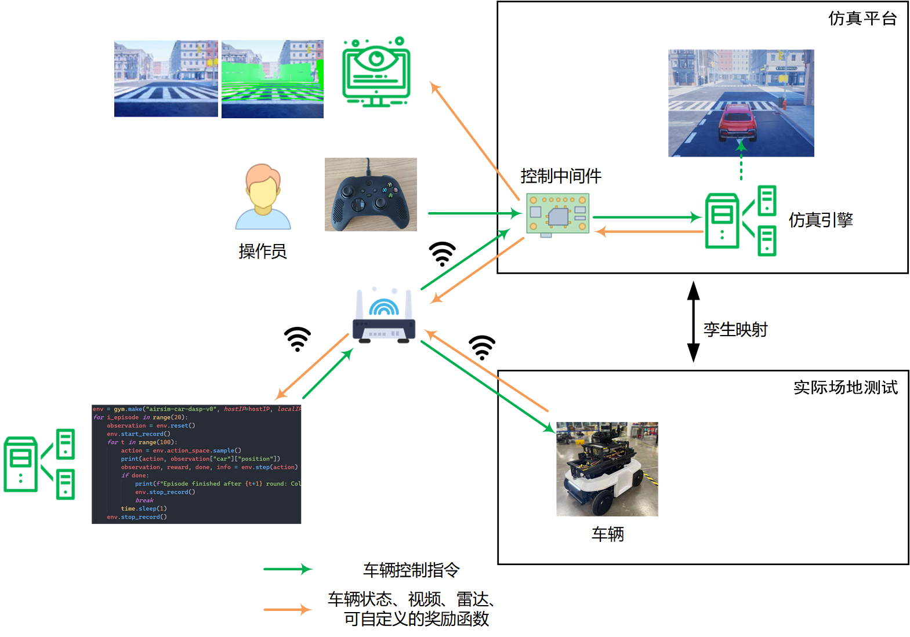

## 欢迎来到 DASP for AirSim

DASP for AirSim是基于[AirSim](https://github.com/microsoft/AirSim)和[虚幻引擎](https://www.unrealengine.com/)构建的分布式汽车仿真平台。它通过控制中间件提供了车辆仿真的物理状态、视景和雷达等数据，并支持人工手柄操作或是智能算法控制。其中[DASP](https://github.com/yvan233/DASP)能够模拟分布式环境、验证分布式算法可行性，并包含了调试机制，支持多个算法并行运行，在未来将支持多计算机联合仿真。

仿真平台部署图：



**查看快速演示**

手动模式

[](https://cloud.tsinghua.edu.cn/d/500440f3db224883a1d2/files/?p=%2Fdemo%2Fdemo_manul.mp4)

自动模式

[](https://cloud.tsinghua.edu.cn/d/500440f3db224883a1d2/files/?p=%2Fdemo%2Fdemo_auto.mp4)

Gym模式

[](https://cloud.tsinghua.edu.cn/d/500440f3db224883a1d2/files/?p=%2Fdemo%2Fdemo_gym.mp4)


## DASP for AirSim安装说明

仿真平台要求硬件环境是Windows操作系统。

### 安装Python3

如果已经有Python3环境，则可以跳过这一步，到[安装DASP for AirSim](#2.2)。

参考这个[链接](https://www.runoob.com/python3/python3-install.html)完成Python3的安装，安装时需要将Python添加到系统变量。

**环境验证**：安装成功后，按 Win+R 键，输入 cmd 调出命令提示符。输入 python，如果出现Python 3.x.x的提示，说明Python3环境安装成功。

### <span id="2.2">安装DASP for AirSim</span>

1. 获取项目文件
   - [文件链接](https://cloud.tsinghua.edu.cn/d/500440f3db224883a1d2/files/?p=%2FDASP%20for%20AirSim.zip)
   - 解压`DASP for AirSim.zip`	

2. Python依赖

   - 通过pip或者conda安装以下包`requests`，`pymysql`，`gym`

     以管理员方式运行cmd

     ```
     pip install requests
     pip install pymysql
     pip install gym
     ```

3. 安装AirSim Python API

   - 在`DASP for AirSim\PythonClient`目录下，以管理员方式运行cmd

   - 安装airsim

     ```
     pip install -e .
     ```

     **备注**：如果已经安装过airsim环境，可以跳过这一步，但仍需要安装airgym

   - 安装airgym

     ```
     cd reinforcement_learning
     pip install -e . 
     ```

### 安装城市环境

1. 获取发布的城市环境

   - [文件链接](https://cloud.tsinghua.edu.cn/d/500440f3db224883a1d2/files/?p=%2FDASP%20for%20AirSim.zip)
   - 解压`City.zip`	

2. 运行City.exe。

   **备注1**：如果遇到缺失运行环境的提示，点击安装/确认即可。

   **备注2**：如果遇到杀毒软件提醒，请允许运行。

   **备注3**：如果想窗口化运行，点击run.bat。

   **备注4**：如果想修改分辨率，需要用记事本打开run.bat，修改参数。

3. 此时会跳出一个对话框，点击 “Yes”，就会出现一个小车（如果点击的是 “No”，就会出现一个四旋翼）

4. 通过4个方向键可以控制小车的前后左右，通过`Alt+tab`切出鼠标，通过`Alt+F4`退出程序。

   **备注**：`F`为切换第一人称视角，`/`为切换第三人称视角，更多说明通过`F1`查看。

5. 将[demo/settings.json](demo/settings.json) 添加到`此电脑/文档/AirSim/` ，覆盖原文件，这是AirSim环境的配置文件。此时再运行City.exe会出现红色小车。

   

## 定制UE环境

如果不需要自定义UE环境，可以跳过本节内容，到[DASP for AirSim使用说明](#4)。

### 安装Unreal Engine

- 在[Unreal engine官网](https://www.unrealengine.com/zh-CN)注册一个epic游戏账户

- 下载[`Epic Games Launcher`](https://www.unrealengine.com/zh-CN/download)


- 运行`Epic Games Launcher`，在`库`选项卡里，点击`添加版本`，选择`Unreal 4.27`。然后等待安装完成。

### 编译AirSim

1. 安装[visual studio 2019](https://docs.microsoft.com/en-us/visualstudio/releases/2019/release-notes)

   - 选择 使用C++的桌面开发” under 工作负荷

   - 选择 “Windows 10 SDK 10.0.18362”

   - 选择 使用.NET桌面开发

   - 安装完成后重启电脑


2. 编译AirSim

   - 下载[AirSim源码](https://github.com/microsoft/AirSim/archive/refs/tags/v1.7.0-windows.zip)，并解压。

   - 运行"Developer Command Prompt for VS 2019"

     ```
     cd Airsim
     build.cmd
     ```

     **备注1**：在开始菜单搜索，很容易能找到这个。

     **备注2**：一定要以管理员方式运行。

     **备注3**：可能需要VPN。

   - 编译完之后，会生成一个`Unreal\plugins`文件夹。以后需要将这个文件夹丢到Unreal工程中。因为Airsim是作为Unreal的一个插件运行的。


### 定制UE环境

流程参考这个[链接](https://zhuanlan.zhihu.com/p/271953448)

本项目的工程文件在这个[链接](https://cloud.tsinghua.edu.cn/d/500440f3db224883a1d2/?p=%2Fproject&mode=list)中，下载所有文件后，点击`city project.zip.001`进行解压即可得到工程文件。

运行`Unreal Engine`，选择`city project\City.uproject` 工程


## <span id="4">DASP for AirSim使用说明</span>

DASP for AirSim有三种运行模式，自动/手动/Gym，并分别提供了demo脚本。

### 自动模式

1. 运行City.exe

2. **在DASP for AirSim文件夹目录**下，运行系统启动脚本

   ```
   python script/start.py
   ```

   若看到`[Car0]Airsim: 开始执行`的提示，说明系统已和仿真环境建立连接。

3. 在另一个终端下，运行自动控制脚本

   ```
   python demo/demo_auto.py
   ```

   在此终端下会打印发送的控制指令，仿真环境中的小车会执行相应的指令。

4. 第3步执行完成后可在系统目录`D:\Qiyuan\Record`中看到以时间为名的文件夹，其中包含了小车物理状态csv文件和运行期间的视频、雷达数据。

### Gym模式

   第1、2步同上所示。

3. 在另一个终端下，运行gym demo脚本

   ```
   python demo/demo_gym.py
   ```

   在此终端下会打印gym中的离散控制指令和小车位置数据。

   小车会进行随机漫游，发生碰撞后会重置到初始状态，共执行20次。

4. 完成后可在系统目录`D:\Qiyuan\Record`中看到以时间为名的文件夹，其中包含了小车每一次碰撞前的物理状态csv文件和运行期间的视频、雷达数据。

### 手动模式

   第1、2步同上所示。

3. 连接xbox手柄。

   **备注**：可以运行测试脚本`python xbox/xboxtest`测试xbox输入是否正常。

4. 在另一个终端下，运行手柄控制脚本

   ```
   python demo/demo_manul.py
   ```

   左方向键控制左右，`Y`为油门，`A`为倒车，`B`为刹车。

   在此终端下会打印中接收到的控制指令。小车会根据接收到的控制指令移动。

### 文件及API说明   
#### DASP启动脚本


DASP的启动脚本`start.py`如下，如果只关心自动驾驶算法设计可以跳过本节。

```python
# 启动系统并运行分布式算法
import time 
import sys
sys.path.insert(1,".") # 把上一级目录加入搜索路径
from threading import Thread
from moniter import moniter
from DASP.module import Node
from DASP.control import ControlMixin

nodeNum = 2  # 节点数量
rootnode = "Car0" # 根节点ID
nodelist = [] # 节点进程列表
Controlmixin = ControlMixin("Pc") # 控制函数集合

# 启动监控脚本
t = Thread(target=moniter,)    
t.start()

# 启动节点进程
for i in range(nodeNum):
    node = Node(i+1,mode = False)
    nodelist.append(node)

time.sleep(2)
DAPPname = "Airsim"
print("开始任务："+DAPPname)
Controlmixin.StartTask(DAPPname,rootnode)
```
nodeNum为节点数量，rootnode为系统根节点ID。

节点进程由类Node启动，Node初始化时输入`mode=True`可打印节点进程输出信息。

ControlMixin为控制函数集合类，仿真时初始化参数"Pc"，控制函数类包含运行DAPP、暂停DAPP、恢复DAPP、停止DAPP等功能，具体可参考[`DASP/control/ControlMixin.py`](DASP/control/ControlMixin.py)源码。

`moniter`为监控函数，监听本地50000端口，节点进程的信息将发送到监控脚本显示。

网络的基本拓扑由[`DASP/task_info/system/topology.txt`](DASP/task_info/system/topology.txt)定义。每一个DAPP为`DASP/task_info/system/`下的一个子文件夹，包含了`question.py`算法文件和`topology.txt`拓扑文件，各任务的拓扑文件为基本拓扑的子图。

**仿真引擎的IP及小车名字在[`DASP/task_info/AirSim/topology.txt`](DASP/task_info/Airsim/topology.txt)中配置。**

DASP更多细节请参考[链接](https://github.com/yvan233/DASP)。

#### 车辆控制API

车辆API在文件[`DaspCarClinet.py`](demo/DaspCarClient.py)中定义。数据格式在[`AirSimCarAgent.py`](DASP/task_info/Airsim/AirSimCarAgent.py)中定义。

- `get_state`：获取车辆在虚幻环境中的状态。是一个字典数据，包含时间戳、车辆位置、姿态、速度、油门、方向、刹车、线速度、线加速度、角速度、角加速度。
- `get_collision`： 获取车辆的碰撞信息。是一个字典数据，包含是否碰撞、碰撞物体。
- `get_image`：监听本地5001端口，从UDP视频流中获取图像数据。
- `get_lidar`:  监听本地5002端口，从UDP数据流中获取雷达数据。
- `do_action`：执行动作。输入是一个字典数据 `{"throttle": 1,"steering": 0,"brake": 0}`，其中`throttle`为油门，[0,1]为前进，[-1,0)为倒车；`steering`为转向，[-50,50]表示转向角度；`brake`为刹车，[0,1]表示刹车度。
- `reset`：这会将车辆重置为其原始启动状态。
- `start_record`：开始记录数据，根目录为`D:\Qiyuan\Record`。
- `stop_record`：结束记录数据。

#### Gym API

gym模型在文件[`dasp_car_env.py`](PythonClient/reinforcement_learning/airgym/envs/dasp_car_env.py)中定义。

- `step`：在每个时间点上，智能体执行 action，环境返回上一次 action 的观测和奖励
  - action已离散化，在`dasp_car_env.py`中的`_do_action`函数。
  - 观测 observation：在`dasp_car_env.py`中的`_get_obs`函数。包含车辆状态信息、碰撞信息、图像数据、雷达数据。
  - 奖励 reward：在`dasp_car_env.py`中的`_compute_reward`函数。可自定义。
  - 完成 done: 表示是否需要将环境重置，现在定义为发生碰撞。
  - 信息 info: 针对调试过程的诊断信息。可自定义。
- `reset`：这会将车辆重置为其原始启动状态。
- `start_record`：开始记录数据，根目录为`D:\Qiyuan\Record`。
- `stop_record`：结束记录数据

## 其他参考资料

- [AirSim官方文档](https://microsoft.github.io/AirSim/)
- [AirSim论文(FSR 2017 Conference)](https://arxiv.org/abs/1705.05065)
- [AirSim GitHub 问题列表](https://github.com/microsoft/airsim/issues)
- [【知乎】AirSim仿真平台教程](https://www.zhihu.com/column/multiUAV)
